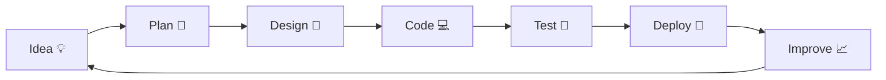

# 🚀 Hi there, I'm Sudhir Singh! 👨‍💻

<div align="center">

<!-- ╔══════════════════════════════════════════════════════════════════════════╗ -->
<!-- ║                                                                          ║ -->
<!-- ║                    🌟 WELCOME TO MY GITHUB UNIVERSE 🌟                    ║ -->
<!-- ║                                                                          ║ -->
<!-- ╚══════════════════════════════════════════════════════════════════════════╝ -->

<!-- ▀▀▀▀▀▀▀▀▀▀▀▀▀▀▀▀▀▀▀▀▀▀▀▀▀▀▀▀▀▀▀▀▀▀▀▀▀▀▀▀▀▀▀▀▀▀▀▀▀▀▀▀▀▀▀▀▀▀▀▀▀▀▀▀▀▀▀▀▀▀▀▀▀▀▀ -->
<!-- ████████████████████████  ANIMATED HEADER  ████████████████████████████████ -->
<!-- ▄▄▄▄▄▄▄▄▄▄▄▄▄▄▄▄▄▄▄▄▄▄▄▄▄▄▄▄▄▄▄▄▄▄▄▄▄▄▄▄▄▄▄▄▄▄▄▄▄▄▄▄▄▄▄▄▄▄▄▄▄▄▄▄▄▄▄▄▄▄▄▄▄▄▄ -->


<br/>

<!-- ═══════════════════════════════════════════════════════════════════════════ -->
<!--                          ✨ ANIMATED INTRO ✨                               -->
<!-- ═══════════════════════════════════════════════════════════════════════════ -->


<br/><br/>

<!-- ANIMATED WAVE SEPARATOR -->


<br/>

<!-- ╔══════════════════════════════════════════════════════════════════════════╗ -->
<!-- ║                  🎭 ANIMATED NAME - LETTER BY LETTER 🎭                  ║ -->
<!-- ╚══════════════════════════════════════════════════════════════════════════╝ -->

<!-- FIRST NAME ANIMATION -->


<br/>

<!-- LAST NAME ANIMATION -->


<br/><br/>

<!-- ═══════════════════════════════════════════════════════════════════════════ -->
<!--                    🌈 RAINBOW LETTER BADGES 🌈                              -->
<!-- ═══════════════════════════════════════════════════════════════════════════ -->

<!-- SUDHIR -->


&nbsp;&nbsp;&nbsp;&nbsp;
<!-- SINGH -->


<br/><br/>

<!-- ═══════════════════════════════════════════════════════════════════════════ -->
<!--                      📝 ANIMATED SUBTITLE 📝                                -->
<!-- ═══════════════════════════════════════════════════════════════════════════ -->


<br/><br/>

<!-- ═══════════════════════════════════════════════════════════════════════════ -->
<!--                     🎨 ANIMATED TECH ICONS ROW 🎨                           -->
<!-- ═══════════════════════════════════════════════════════════════════════════ -->


&nbsp;&nbsp;

&nbsp;&nbsp;

&nbsp;&nbsp;

&nbsp;&nbsp;


<br/><br/>

<!-- ═══════════════════════════════════════════════════════════════════════════ -->
<!--                     🔗 SOCIAL BADGES 🔗                                     -->
<!-- ═══════════════════════════════════════════════════════════════════════════ -->

<a href="https://sudhirdevops1.github.io/">
  
</a>
&nbsp;&nbsp;
<a href="https://linkedin.com/in/your-linkedin-username">
  
</a>
&nbsp;&nbsp;
<a href="mailto:your-email@example.com">
  
</a>
&nbsp;&nbsp;
<a href="https://github.com/SudhirDevOps1">
  
</a>
&nbsp;&nbsp;
<a href="https://twitter.com/your-twitter">
  
</a>

<br/><br/>

<!-- ═══════════════════════════════════════════════════════════════════════════ -->
<!--                     📊 PROFILE STATS BADGES 📊                              -->
<!-- ═══════════════════════════════════════════════════════════════════════════ -->


&nbsp;&nbsp;

&nbsp;&nbsp;


<br/><br/>

<!-- ═══════════════════════════════════════════════════════════════════════════ -->
<!--                          ⚡ DIVIDER ⚡                                       -->
<!-- ═══════════════════════════════════════════════════════════════════════════ -->


</div>

<br/>

<!-- ╔══════════════════════════════════════════════════════════════════════════╗ -->
<!-- ║                                                                          ║ -->
<!-- ║                        🎯 ABOUT ME SECTION 🎯                             ║ -->
<!-- ║                                                                          ║ -->
<!-- ╚══════════════════════════════════════════════════════════════════════════╝ -->

<h2>
  
  &nbsp;
  
</h2>


```yaml
┌─────────────────────────────────────────────────────────┐
│                    👤 SUDHIR SINGH                      │
├─────────────────────────────────────────────────────────┤
│  located_in   : Bihar, India 🇮🇳                        │
│  current_role : BCA Student & Self-taught Developer     │
│  online       : [GitHub](https://github.com/SudhirDevOps1)
├─────────────────────────────────────────────────────────┤
│                  💡 INTERESTS                           │
├─────────────────────────────────────────────────────────┤
│  • Full-Stack Development (MERN)                        │
│  • AI & Machine Learning Basics                         │
│  • Cloud Computing (AWS, Cloudflare)                    │
│  • Open Source Contributions                            │
├─────────────────────────────────────────────────────────┤
│                  🚀 2026 GOALS                          │
├─────────────────────────────────────────────────────────┤
│  ✓ Master React + Node.js                               │
│  ✓ Deploy 5 live projects                               │
│  ✓ Get first Open Source PR merged                      │
│  ✓ Build a small SaaS tool                              │
├─────────────────────────────────────────────────────────┤
│  fun_fact : "Bugs are just features in disguise! 🐛✨"  │
│  motto     : "Code, Deploy, Repeat 🔁"                  │
└─────────────────────────────────────────────────────────┘
```

<br/>

###  &nbsp; Quick Facts

<table>
  <tr>
    <td></td>
    <td><b>Portfolio:</b></td>
    <td><a href="https://sudhirdevops1.github.io/">sudhirdevops1.github.io</a></td>
  </tr>
  <tr>
    <td></td>
    <td><b>Tech Interests:</b></td>
    <td>Full-Stack Development, AI Automation, & Ethical Hacking</td>
  </tr>
  <tr>
    <td></td>
    <td><b>Current Projects:</b></td>
    <td>Building high-utility tools like PDF Utilities and Code-to-Image generators</td>
  </tr>
  <tr>
    <td></td>
    <td><b>Learning:</b></td>
    <td>Currently diving deep into Advanced Python and Cloud Computing</td>
  </tr>
  <tr>
    <td></td>
    <td><b>Philosophy:</b></td>
    <td>I believe in automating everything that can be automated!</td>
  </tr>
  <tr>
    <td></td>
    <td><b>2026 Goal:</b></td>
    <td>Master React.js & Node.js and contribute to Open Source</td>
  </tr>
</table>

<br clear="both"/>

<br/>

<div align="center">
  
</div>

<br/>

<!-- ╔══════════════════════════════════════════════════════════════════════════╗ -->
<!-- ║                                                                          ║ -->
<!-- ║                       🏆 GITHUB TROPHIES 🏆                               ║ -->
<!-- ║                                                                          ║ -->
<!-- ╚══════════════════════════════════════════════════════════════════════════╝ -->

<h2>
  
  &nbsp;
  
</h2>

<div align="center">
  <a href="https://github.com/ryo-ma/github-profile-trophy">
    
  </a>
</div>

<br/>

<div align="center">
  
</div>

<br/>

<!-- ╔══════════════════════════════════════════════════════════════════════════╗ -->
<!-- ║                                                                          ║ -->
<!-- ║                     🛠️ TECH STACK & SKILLS 🛠️                            ║ -->
<!-- ║                                                                          ║ -->
<!-- ╚══════════════════════════════════════════════════════════════════════════╝ -->

<h2>
  
  &nbsp;
  
</h2>

<div align="center">

<!-- ANIMATED TECH ICONS -->
<a href="https://skillicons.dev">
  
</a>

</div>

<br/>

<!-- ═══════════════════════════════════════════════════════════════════════════ -->
<!--                     💻 PROGRAMMING LANGUAGES 💻                             -->
<!-- ═══════════════════════════════════════════════════════════════════════════ -->

###  &nbsp; Programming Languages

<div align="center">


</div>

<br/>

<!-- ═══════════════════════════════════════════════════════════════════════════ -->
<!--                     📚 FRAMEWORKS & LIBRARIES 📚                            -->
<!-- ═══════════════════════════════════════════════════════════════════════════ -->

###  &nbsp; Frameworks & Libraries

<div align="center">


</div>

<br/>

<!-- ═══════════════════════════════════════════════════════════════════════════ -->
<!--                       ☁️ DATABASES & CLOUD ☁️                               -->
<!-- ═══════════════════════════════════════════════════════════════════════════ -->

###  &nbsp; Databases & Cloud

<div align="center">


</div>

<br/>

<!-- ═══════════════════════════════════════════════════════════════════════════ -->
<!--                       🔧 TOOLS & PLATFORMS 🔧                               -->
<!-- ═══════════════════════════════════════════════════════════════════════════ -->

###  &nbsp; Tools & Platforms

<div align="center">


</div>

<br/>

<!-- ═══════════════════════════════════════════════════════════════════════════ -->
<!--                     📊 SKILL PROGRESS BARS 📊                               -->
<!-- ═══════════════════════════════════════════════════════════════════════════ -->

<details>
<summary><b>📊 &nbsp; Skill Proficiency Levels (Click to Expand)</b></summary>
<br/>

```
╔═══════════════════════════════════════════════════════════════════════════╗
║                        🎯 SKILL PROFICIENCY CHART 🎯                      ║
╠═══════════════════════════════════════════════════════════════════════════╣
║                                                                           ║
║   Python          ████████████████████░░░░░  80%  ⭐⭐⭐⭐               ║
║   JavaScript      ███████████████████░░░░░░  75%  ⭐⭐⭐⭐               ║
║   React.js        ██████████████░░░░░░░░░░░  55%  ⭐⭐⭐                 ║
║   Node.js         █████████████░░░░░░░░░░░░  50%  ⭐⭐⭐                 ║
║   HTML/CSS        █████████████████████░░░░  85%  ⭐⭐⭐⭐⭐             ║
║   Git/GitHub      ███████████████████░░░░░░  75%  ⭐⭐⭐⭐               ║
║   MongoDB         ██████████████░░░░░░░░░░░  55%  ⭐⭐⭐                 ║
║   AWS             ████████████░░░░░░░░░░░░░  45%  ⭐⭐                   ║
║   Docker          ██████████░░░░░░░░░░░░░░░  40%  ⭐⭐                   ║
║   Linux           ████████████████░░░░░░░░░  65%  ⭐⭐⭐                 ║
║                                                                           ║
╚═══════════════════════════════════════════════════════════════════════════╝
```

</details>

<br/>

<div align="center">
  
</div>

<br/>

<!-- ╔══════════════════════════════════════════════════════════════════════════╗ -->
<!-- ║                                                                          ║ -->
<!-- ║                       🌟 FEATURED PROJECTS 🌟                            ║ -->
<!-- ║                                                                          ║ -->
<!-- ╚══════════════════════════════════════════════════════════════════════════╝ -->

<h2>
  
  &nbsp;
  
</h2>

<div align="center">

|  **Project** | 📝 **Description** | 🛠️ **Tech Stack** | 🔗 **Link** |
|:---:|:---:|:---:|:---:|
| **📄 PDF Generator Pro** | Web-based tool for creating rich-text PDFs with 10+ themes |    | [🔗 View](#) |
| **🔧 Sudhir PDF Utility** | Advanced Python tool for PDF compression & encryption |   | [🔗 View](#) |
| **🖼️ Code-to-Image** | Transform code snippets into beautiful images |   | [🔗 View](#) |
| **🌐 Portfolio Website** | Personal portfolio with modern animations |   | [🔗 View](https://sudhirdevops1.github.io/) |

</div>

<br/>

<div align="center">
  
</div>

<br/>

<!-- ╔══════════════════════════════════════════════════════════════════════════╗ -->
<!-- ║                                                                          ║ -->
<!-- ║                      🐍 CONTRIBUTION SNAKE 🐍                            ║ -->
<!-- ║                                                                          ║ -->
<!-- ╚══════════════════════════════════════════════════════════════════════════╝ -->

<h2>
  
  &nbsp;
  
</h2>

<div align="center">

<picture>
  <source media="(prefers-color-scheme: dark)" srcset="https://raw.githubusercontent.com/SudhirDevOps1/SudhirDevOps1/output/github-contribution-grid-snake-dark.svg">
  <source media="(prefers-color-scheme: light)" srcset="https://raw.githubusercontent.com/SudhirDevOps1/SudhirDevOps1/output/github-contribution-grid-snake.svg">
  
</picture>

<br/><br/>

<!-- 3D CONTRIBUTION CALENDAR -->


</div>

<br/>

<div align="center">
  
</div>

<br/>

<!-- ╔══════════════════════════════════════════════════════════════════════════╗ -->
<!-- ║                                                                          ║ -->
<!-- ║                       📊 GITHUB STATISTICS 📊                            ║ -->
<!-- ║                                                                          ║ -->
<!-- ╚══════════════════════════════════════════════════════════════════════════╝ -->

<h2>
  
  &nbsp;
  
</h2>

<div align="center">

<!-- GITHUB STATS CARDS - ROW 1 -->

&nbsp;&nbsp;


<br/><br/>

<!-- TOP LANGUAGES -->


</div>

<br/>

<!-- ═══════════════════════════════════════════════════════════════════════════ -->
<!--                     ⚡ DETAILED GITHUB METRICS ⚡                            -->
<!-- ═══════════════════════════════════════════════════════════════════════════ -->

<details>
<summary><b>⚡ &nbsp; Detailed GitHub Metrics (Click to Expand)</b></summary>
<br/>

<div align="center">


<br/><br/>


</div>

</details>

<br/>

<div align="center">
  
</div>

<br/>

<!-- ╔══════════════════════════════════════════════════════════════════════════╗ -->
<!-- ║                                                                          ║ -->
<!-- ║                        🎵 SPOTIFY NOW PLAYING 🎵                         ║ -->
<!-- ║                                                                          ║ -->
<!-- ╚══════════════════════════════════════════════════════════════════════════╝ -->

<h2>
  
  &nbsp;
  
</h2>

<div align="center">

<a href="https://open.spotify.com/user/YOUR_SPOTIFY_ID">
  
</a>

<br/><br/>

<!-- ANIMATED MUSIC GIFS -->

&nbsp;&nbsp;&nbsp;&nbsp;

&nbsp;&nbsp;&nbsp;&nbsp;


</div>

<br/>

<div align="center">
  
</div>

<br/>

<!-- ╔══════════════════════════════════════════════════════════════════════════╗ -->
<!-- ║                                                                          ║ -->
<!-- ║                        🤝 CONNECT WITH ME 🤝                             ║ -->
<!-- ║                                                                          ║ -->
<!-- ╚══════════════════════════════════════════════════════════════════════════╝ -->

<h2>
  
  &nbsp;
  
</h2>

<div align="center">

<a href="https://sudhirdevops1.github.io/">
  
</a>
&nbsp;&nbsp;
<a href="https://linkedin.com/in/your-linkedin-username">
  
</a>
&nbsp;&nbsp;
<a href="mailto:your-email@example.com">
  
</a>
&nbsp;&nbsp;
<a href="https://twitter.com/your-twitter">
  
</a>
&nbsp;&nbsp;
<a href="https://instagram.com/your-instagram">
  
</a>
&nbsp;&nbsp;
<a href="https://discord.gg/YOUR_DISCORD">
  
</a>

<br/><br/>

<!-- ANIMATED HEART -->


</div>

<br/>

<div align="center">
  
</div>

<br/>

<!-- ╔══════════════════════════════════════════════════════════════════════════╗ -->
<!-- ║                                                                          ║ -->
<!-- ║                      💬 DEV QUOTE OF THE DAY 💬                          ║ -->
<!-- ║                                                                          ║ -->
<!-- ╚══════════════════════════════════════════════════════════════════════════╝ -->

<h2>
  
  &nbsp;
  
</h2>

<div align="center">


<br/><br/>


</div>

<br/>

<!-- ═══════════════════════════════════════════════════════════════════════════ -->
<!--                          😂 DEV HUMOR 😂                                    -->
<!-- ═══════════════════════════════════════════════════════════════════════════ -->

<details>
<summary><b>😂 &nbsp; Random Dev Meme (Click to Reveal)</b></summary>
<br/>

<div align="center">
  
</div>

</details>

<br/>

<div align="center">
  
</div>

<br/>

<!-- ═══════════════════════════════════════════════════════════════════════════ -->
<!--                   📈 WEEKLY DEVELOPMENT BREAKDOWN 📈                        -->
<!-- ═══════════════════════════════════════════════════════════════════════════ -->

<details>
<summary><b>📈 &nbsp; Weekly Development Breakdown (Click to Expand)</b></summary>
<br/>

```
╔═══════════════════════════════════════════════════════════════════════════╗
║                     ⏰ CODING TIME DISTRIBUTION ⏰                        ║
╠═══════════════════════════════════════════════════════════════════════════╣
║                                                                           ║
║   🌞 Morning      45 commits    ████████░░░░░░░░░░░░░░░░░   32.37%       ║
║   🌆 Daytime      52 commits    █████████░░░░░░░░░░░░░░░░   37.41%       ║
║   🌃 Evening      35 commits    ██████░░░░░░░░░░░░░░░░░░░   25.18%       ║
║   🌙 Night         7 commits    █░░░░░░░░░░░░░░░░░░░░░░░░   05.04%       ║
║                                                                           ║
╚═══════════════════════════════════════════════════════════════════════════╝

╔═══════════════════════════════════════════════════════════════════════════╗
║                       📅 DAY-WISE ACTIVITY 📅                             ║
╠═══════════════════════════════════════════════════════════════════════════╣
║                                                                           ║
║   Monday        23 commits    ████░░░░░░░░░░░░░░░░░░░░░   16.55%         ║
║   Tuesday       18 commits    ███░░░░░░░░░░░░░░░░░░░░░░   12.95%         ║
║   Wednesday     25 commits    ████░░░░░░░░░░░░░░░░░░░░░   17.99%         ║
║   Thursday      20 commits    ███░░░░░░░░░░░░░░░░░░░░░░   14.39%         ║
║   Friday        22 commits    ████░░░░░░░░░░░░░░░░░░░░░   15.83%         ║
║   Saturday      18 commits    ███░░░░░░░░░░░░░░░░░░░░░░   12.95%         ║
║   Sunday        13 commits    ██░░░░░░░░░░░░░░░░░░░░░░░   09.35%         ║
║                                                                           ║
╚═══════════════════════════════════════════════════════════════════════════╝
```

</details>

<br/>

<!-- ╔══════════════════════════════════════════════════════════════════════════╗ -->
<!-- ║                                                                          ║ -->
<!-- ║                        ☕ SUPPORT MY WORK ☕                              ║ -->
<!-- ║                                                                          ║ -->
<!-- ╚══════════════════════════════════════════════════════════════════════════╝ -->

<h2>
  
  &nbsp;
  
</h2>

<div align="center">

<a href="https://www.buymeacoffee.com/YOUR_USERNAME">
  
</a>
&nbsp;&nbsp;
<a href="https://ko-fi.com/YOUR_USERNAME">
  
</a>
&nbsp;&nbsp;
<a href="https://paypal.me/YOUR_USERNAME">
  
</a>

</div>

<br/>

<div align="center">
  
</div>

<br/>

<!-- ╔══════════════════════════════════════════════════════════════════════════╗ -->
<!-- ║                                                                          ║ -->
<!-- ║                         🎉 FINAL MESSAGE 🎉                              ║ -->
<!-- ║                                                                          ║ -->
<!-- ╚══════════════════════════════════════════════════════════════════════════╝ -->

<div align="center">


<br/><br/>

<!-- ANIMATED CODING GIF -->


<br/><br/>

<!-- VISITOR COUNTER -->


<br/><br/>

<!-- FOOTER WAVE -->


<br/>

<!-- MADE WITH LOVE -->


<br/><br/>

---

<br/>

**⭐ From [Sudhir Singh](https://github.com/SudhirDevOps1) with 💖**

<br/>

<!-- SECRET EASTER EGG -->
<!-- 
╔═══════════════════════════════════════════════════════════════════════════╗
║                                                                           ║
║   🎉 Congratulations! You found the secret easter egg!                    ║
║                                                                           ║
║   Thanks for exploring my profile so thoroughly!                          ║
║   Feel free to connect with me on any platform above.                     ║
║                                                                           ║
║   Keep coding and stay awesome! 🚀                                        ║
║                                                                           ║
╚═══════════════════════════════════════════════════════════════════════════╝
-->

</div>

---

## 📫 Quick Contact

| Platform | Link |
|----------|------|
| 🌐 **Portfolio** | [sudhirdevops1.github.io](https://sudhirdevops1.github.io/) |
| 💼 **LinkedIn** | [Connect](https://linkedin.com/in/your-linkedin-username) |
| 📧 **Email** | [Contact](mailto:your-email@example.com) |
| 🐦 **Twitter** | [Follow](https://twitter.com/your-twitter) |
| 📸 **Instagram** | [Follow](https://instagram.com/your-instagram) |
| 💬 **Discord** | [Join](https://discord.gg/YOUR_DISCORD) |

---

## 📚 What I'm Currently Learning

<div align="center">

| 📖 Learning | 🎯 Goal | 📅 Timeline |
|------------|---------|-------------|
| React Advanced Patterns | Build complex SPAs | Q1 2026 |
| Node.js & Express | Create REST APIs | Q1 2026 |
| AWS Cloud Services | Deploy scalable apps | Q2 2026 |
| Docker & Kubernetes | Containerize apps | Q2 2026 |
| Machine Learning | Build AI models | Q3 2026 |

</div>

---

## 🏆 Achievements

<div align="center">

| Achievement | Badge |
|------------|-------|
| ⭐ GitHub Profile Views |  |
| 🔥 Current Streak |  |
| 💻 Total Commits |  |
| 📦 Repositories |  |

</div>

---

## 🎯 2026 Goals Checklist

- [ ] 🚀 Deploy 5+ production-ready projects
- [ ] 🤝 Contribute to 10+ open-source projects
- [ ] 📝 Write 20+ technical blog posts
- [ ] 🎓 Complete 3+ advanced online courses
- [ ] 💼 Land my first developer internship
- [ ] 🏗️ Build a SaaS product
- [ ] 🐙 Achieve 1000+ GitHub followers
- [ ] 📈 Reach 10,000+ profile views

---

<div align="center">

### 🌟 Let's Build Something Amazing Together! 🌟


</div>

---

<!-- ╔══════════════════════════════════════════════════════════════════════════╗ -->
<!-- ║                                                                          ║ -->
<!-- ║                    ✨ EXTRA PROFESSIONAL ANIMATION PACK ✨                ║ -->
<!-- ║                                                                          ║ -->
<!-- ╚══════════════════════════════════════════════════════════════════════════╝ -->

<div align="center">


<br/>


<br/><br/>


&nbsp;&nbsp;&nbsp;

&nbsp;&nbsp;&nbsp;


<br/><br/>


</div>

---

## 🧬 Developer DNA

<div align="center">

| 💡 Mindset | ⚙️ Execution | 🚀 Outcome |
|:---:|:---:|:---:|
| Curious Learner | Builds small, ships fast | Real-world projects |
| Problem Solver | Automates boring tasks | More productivity |
| Full-Stack Explorer | Connects UI, API, DB | Complete apps |
| DevOps Beginner | Learns cloud and CI/CD | Better deployments |
| Open Source Fan | Reads, forks, improves | Stronger collaboration |

<br/>


</div>

---

## 🪄 Animated Skill Universe

<div align="center">


<br/><br/>

<a href="https://skillicons.dev">
  
</a>

<br/><br/>


</div>

---

## 🧭 My Build Workflow

<div align="center">




</div>

---

## 🏗️ Project Factory

<div align="center">

| 🚀 Project Type | 🧩 Features I Like Building | 🛠️ Preferred Stack | 🎯 Status |
|:---:|:---:|:---:|:---:|
| Utility Tools | PDF tools, converters, generators | HTML, Tailwind, JS, Python | 🟢 Active |
| Portfolio Sites | Responsive UI, animations, contact forms | React, Tailwind, Vite | 🟢 Active |
| Dashboards | Charts, filters, auth, CRUD | MERN, REST APIs | 🟡 Learning |
| Automation Bots | File automation, scraping, reports | Python, Bash, APIs | 🟢 Active |
| AI Experiments | Chat tools, prompt helpers, mini ML apps | Python, JS, APIs | 🟡 Exploring |

<br/>


&nbsp;&nbsp;

&nbsp;&nbsp;


</div>

---

## ⚙️ DevOps & Cloud Roadmap

<div align="center">

| Step | Topic | Tools | Progress |
|:---:|:---|:---:|:---:|
| 1 | Linux fundamentals and shell scripting | Linux, Bash | ████████░░ 80% |
| 2 | Git, branching and open-source workflow | Git, GitHub | ███████░░░ 70% |
| 3 | App deployment and hosting | Vercel, Netlify, GitHub Pages | ███████░░░ 70% |
| 4 | Containers and local environments | Docker | █████░░░░░ 50% |
| 5 | CI/CD pipelines | GitHub Actions | ████░░░░░░ 40% |
| 6 | Cloud fundamentals | AWS, Cloudflare | ████░░░░░░ 40% |

<br/>


</div>

---

## 🎮 Fun Developer Mode

<div align="center">


<br/><br/>

| 🕹️ Attribute | Level |
|:---:|:---:|
| Debugging Patience | ⭐⭐⭐⭐☆ |
| UI Creativity | ⭐⭐⭐⭐☆ |
| Backend Logic | ⭐⭐⭐☆☆ |
| Cloud Curiosity | ⭐⭐⭐☆☆ |
| Consistency | ⭐⭐⭐⭐☆ |
| Learning Speed | ⭐⭐⭐⭐☆ |

<br/>


&nbsp;&nbsp;

&nbsp;&nbsp;


</div>

---

## 🧠 Ask Me About

<div align="center">


<br/><br/>

```text
💬 Good topics to start a conversation:

1. Building beginner-friendly full-stack projects
2. Creating useful PDF, image and automation tools
3. Improving GitHub profile README designs
4. Hosting websites on GitHub Pages, Vercel or Netlify
5. Learning roadmap for React, Node.js, Python and DevOps
```

</div>

---

## 🌈 More Animated Badges

<div align="center">


<br/><br/>


</div>

---

## 🧾 Developer Checklist

<div align="center">

| ✅ Habit | Why It Matters |
|:---:|:---|
| Write readable code | Future me should understand it quickly |
| Keep commits meaningful | Projects look professional and easy to review |
| Build reusable components | Faster development and cleaner UI |
| Test before deployment | Fewer bugs and better user experience |
| Document important steps | Helps teammates and open-source users |
| Learn in public | Shows consistency and progress |

</div>

---

## 🛰️ Live Profile Widgets

<div align="center">


<br/><br/>


</div>

---

## 🔥 Motivation Wall

<div align="center">


<br/><br/>

> 🌟 "Code is not just syntax; it is a way to turn imagination into something people can use."

<br/>


&nbsp;&nbsp;


</div>

---

## 🧩 Mini Portfolio Snapshot

<div align="center">

| Section | What You Will Find |
|:---:|:---|
| 🌐 Portfolio | Projects, skills, contact and personal brand |
| 📄 PDF Tools | Utilities for productivity and document workflows |
| 🖼️ Code Visuals | Tools that make code shareable and beautiful |
| 🤖 Automation | Scripts that save time and reduce manual work |
| 📚 Learning Logs | Notes, experiments and progress tracking |

<br/>

<a href="https://sudhirdevops1.github.io/">
  
</a>

</div>

---

## 🎇 Final Animated Footer Plus

<div align="center">


<br/><br/>


&nbsp;&nbsp;&nbsp;

&nbsp;&nbsp;&nbsp;


<br/><br/>


</div>

---

<!-- ╔══════════════════════════════════════════════════════════════════════════╗ -->
<!-- ║                                                                          ║ -->
<!-- ║                  🔎 REAL GITHUB PROFILE DATA SNAPSHOT                    ║ -->
<!-- ║                                                                          ║ -->
<!-- ╚══════════════════════════════════════════════════════════════════════════╝ -->

## 🔎 Verified GitHub Profile Snapshot

<div align="center">


<br/><br/>


<br/><br/>


<br/><br/>

| Field | Real Value From GitHub |
|:---:|:---|
| 👤 Name | Sudhir Singh |
| 🧑‍💻 Username | [SudhirDevOps1](https://github.com/SudhirDevOps1) |
| 🆔 GitHub ID | `234449571` |
| 🌐 Portfolio / Blog | [sudhirdevops1.github.io](https://sudhirdevops1.github.io) |
| 📝 Bio | BCA Student, aspiring full-stack developer, passionate about coding, problem-solving, AI, Python, JavaScript and ethical hacking |
| 📍 Profile Mentions | Bihar |
| 📦 Public Repositories | 77 |
| 👥 Followers | 4 |
| ➡️ Following | 9 |
| 🧾 Public Gists | 0 |
| 🗓️ Joined GitHub | 25 September 2025 |
| 🔄 Profile Updated | 27 April 2026 |
| ✅ Data Checked | 28 April 2026 |

</div>

---

## 🛰️ Real-Time GitHub Badges

<div align="center">


<br/><br/>


</div>

---

## 🚀 Real Recent Projects From My GitHub

<div align="center">


<br/><br/>

| Project | Real Description / Purpose | Main Tech | Stars | Live / Repo |
|:---:|:---|:---:|:---:|:---:|
| [SwarWave-Player](https://github.com/SudhirDevOps1/SwarWave-Player) | Recently created music player project | TypeScript | 1 | [Live](https://swarwave-player.pages.dev/) |
| [swar-wave-test](https://github.com/SudhirDevOps1/swar-wave-test) | Test deployment for SwarWave style project | TypeScript | 0 | [Live](https://swar-wave-test.pages.dev/) |
| [PassVault-Cleaner](https://github.com/SudhirDevOps1/PassVault-Cleaner) | Fresh repository created for password/vault utility work | Not detected yet | 0 | [Repo](https://github.com/SudhirDevOps1/PassVault-Cleaner) |
| [PrivMITLab-Music-Radio](https://github.com/SudhirDevOps1/PrivMITLab-Music-Radio) | Privacy-first music and radio streaming app with offline-ready features, 500+ stations, mood playlists and no tracking | TypeScript | 1 | [Live](https://radio-personal.pages.dev/) |
| [code-to-image-generator](https://github.com/SudhirDevOps1/code-to-image-generator) | Transform code snippets into beautiful shareable images with syntax highlighting and PWA support | HTML | 2 | [Live](https://sudhirdevops1.github.io/code-to-image-generator/) |
| [LEARN-WEBDEVELOPEMENT](https://github.com/SudhirDevOps1/LEARN-WEBDEVELOPEMENT) | Web development learning repository | HTML | 1 | [Live](https://sudhirdevops1.github.io/LEARN-HTML/) |

<br/>


<br/><br/>


</div>

---

## 📊 Real Repository Language Breakdown

<div align="center">

| Repository | Language Data From GitHub API |
|:---:|:---|
| [SwarWave-Player](https://github.com/SudhirDevOps1/SwarWave-Player) | TypeScript `285,645` bytes, CSS `5,864`, HTML `3,876`, JavaScript `2,370` |
| [PrivMITLab-Music-Radio](https://github.com/SudhirDevOps1/PrivMITLab-Music-Radio) | TypeScript `236,990` bytes, CSS `8,375`, JavaScript `4,419`, HTML `2,739` |
| [swar-wave-test](https://github.com/SudhirDevOps1/swar-wave-test) | TypeScript `276,717` bytes, CSS `5,864`, HTML `3,876`, JavaScript `3,126` |
| [code-to-image-generator](https://github.com/SudhirDevOps1/code-to-image-generator) | HTML `158,141` bytes |
| [LEARN-WEBDEVELOPEMENT](https://github.com/SudhirDevOps1/LEARN-WEBDEVELOPEMENT) | HTML `36,616` bytes, JavaScript `3,119` |
| [PassVault-Cleaner](https://github.com/SudhirDevOps1/PassVault-Cleaner) | No language detected yet |

<br/>


</div>

---

## ⚡ Latest Public Activity Snapshot

<div align="center">

| Time UTC | Activity | Repository |
|:---:|:---:|:---:|
| 2026-04-28 13:56 | Push event | [SudhirDevOps1/SudhirDevOps1](https://github.com/SudhirDevOps1/SudhirDevOps1) |
| 2026-04-28 13:40 | Starred / watched own project | [SwarWave-Player](https://github.com/SudhirDevOps1/SwarWave-Player) |
| 2026-04-28 13:32 | Created main branch | [SwarWave-Player](https://github.com/SudhirDevOps1/SwarWave-Player) |
| 2026-04-28 12:42 | Push event | [swar-wave-test](https://github.com/SudhirDevOps1/swar-wave-test) |
| 2026-04-27 14:15 | Push event | [PassVault-Cleaner](https://github.com/SudhirDevOps1/PassVault-Cleaner) |
| 2026-04-27 13:54 | Push event | [PrivMITLab-Music-Radio](https://github.com/SudhirDevOps1/PrivMITLab-Music-Radio) |

<br/>


</div>

---

## 🏅 Real Project Highlights

<div align="center">

| Highlight | Proof |
|:---:|:---|
| Most starred project found | [code-to-image-generator](https://github.com/SudhirDevOps1/code-to-image-generator) with 2 stars |
| Recent TypeScript focus | SwarWave-Player, swar-wave-test and PrivMITLab-Music-Radio are TypeScript-heavy |
| Live Cloudflare Pages apps | [SwarWave Player](https://swarwave-player.pages.dev/), [Swar Wave Test](https://swar-wave-test.pages.dev/), [Radio Personal](https://radio-personal.pages.dev/) |
| GitHub Pages apps | [Portfolio](https://sudhirdevops1.github.io), [Code to Image Generator](https://sudhirdevops1.github.io/code-to-image-generator/), [Learn HTML](https://sudhirdevops1.github.io/LEARN-HTML/) |
| License used in real repos | MIT License on code-to-image-generator and LEARN-WEBDEVELOPEMENT |
| Profile repository | [SudhirDevOps1/SudhirDevOps1](https://github.com/SudhirDevOps1/SudhirDevOps1) powers this GitHub profile README |

<br/>


</div>

---

## 🎯 Profile Upgrade Notes

<div align="center">

```yaml
real_profile_upgrade:
  data_source: "GitHub public API and public repository pages"
  checked_on: "2026-04-28"
  username: "SudhirDevOps1"
  public_repositories: 77
  followers: 4
  following: 9
  portfolio: "https://sudhirdevops1.github.io"
  visible_focus:
    - TypeScript apps
    - HTML/CSS/JavaScript utilities
    - Music and radio web apps
    - Code-to-image generator
    - GitHub profile branding
  promise: "Nothing removed. More real data, animation, and professional presentation added."
```


&nbsp;&nbsp;

&nbsp;&nbsp;


<br/><br/>


</div>
